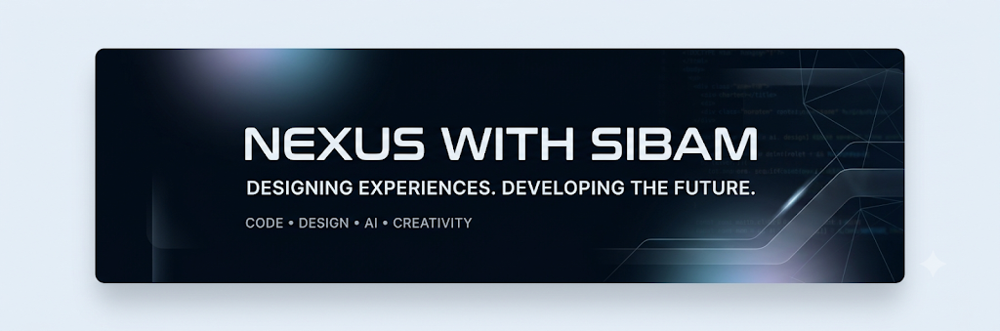
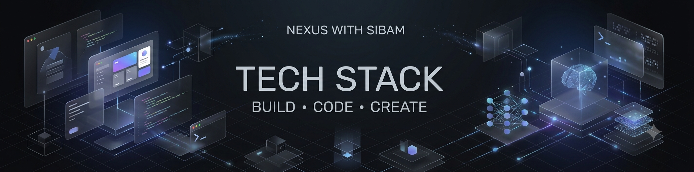
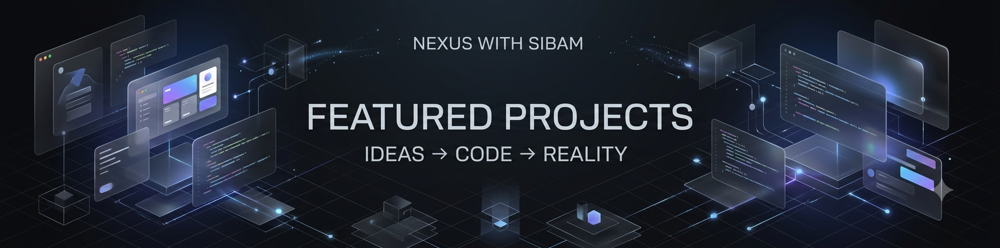
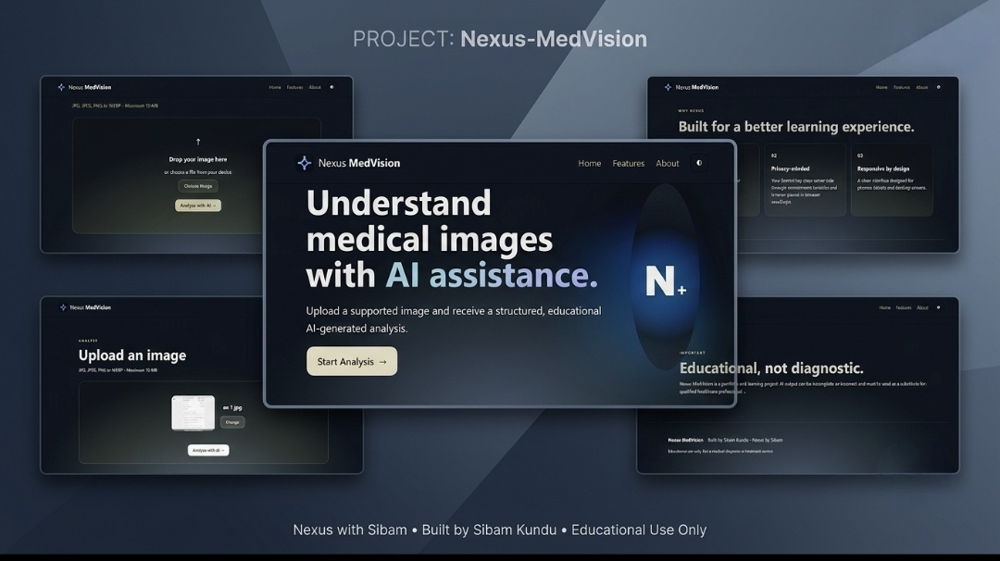
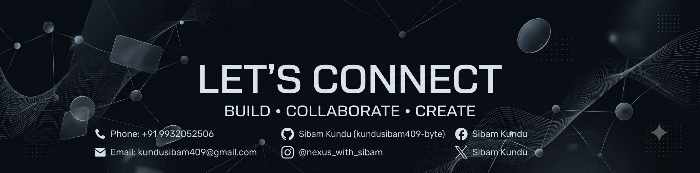

  

---

## 📊 GitHub Statistics

  

---

## 👋 About Me

### Designing Experiences. Developing the Future. 🚀

I'm **Sibam Kundu** — a student, developer, and graphics designer passionate about technology, creativity, and building digital experiences.

---

## 🧰 Tech Stack

  

<h3 align="center">💻 Technologies & Tools</h3>

  

---

## 🚀 Featured Projects

  

  <em>A collection of projects built with code, creativity, and curiosity.</em>

---

### Project 01 — 🍚 WB Ration Connect

<table width="100%">
  <tr>
    <td width="100%" valign="top">
      <h3>🍚 WB Ration Connect</h3>
      
<strong>Web-Based Ration Management System</strong>

      
      

        <strong>WB Ration Connect</strong> is a web-based ration management system designed to digitize and streamline <strong>Public Distribution System operations</strong>.
      

      
      

        <strong>Key Features:</strong> 
        🔐 Secure Admin Login &nbsp; • &nbsp; 📊 Dashboard Analytics 
        👨‍👩‍👧 Family Registration &nbsp; • &nbsp; 👨‍💼 Employee Management 
        📦 Stock Management &nbsp; • &nbsp; 📅 Monthly Distribution 
        📢 Notice Board &nbsp; • &nbsp; 📄 Downloadable Forms 
        🔳 QR Code Integration &nbsp; • &nbsp; 🔎 Smart Search 
        💾 Database Backup &nbsp; • &nbsp; 📱 Responsive Dashboard
      

      
      

        
      

    </td>
  </tr>
</table>

---

### Project 02 — 🎀 Raksha Bandhan Wisher

<table width="100%">
  <tr>
    <td width="100%" valign="top">
      <h3>🎀 Raksha Bandhan Wisher</h3>
      
<strong>Interactive Digital Wishing Experience</strong>

      
      

        <strong>Raksha Bandhan Wisher</strong> is an interactive and beautifully designed digital wishing experience created to make festive greetings more <strong>personal, memorable, and engaging</strong>.
      

      
      

        <strong>Experience:</strong> 
        🎨 Beautiful &nbsp; • &nbsp; ✨ Interactive &nbsp; • &nbsp; 💝 Personal &nbsp; • &nbsp; 🎉 Festive
      

      
      

        
      

    </td>
  </tr>
</table>

---

### Project 03 — 🩺 Nexus-MedVision

<table width="100%">
  <tr>
    <td width="100%" valign="top">
      <h3>🩺 Nexus-MedVision</h3>
      
<strong>AI-Powered Medical Image Analysis Web Application</strong> &nbsp;|&nbsp; <code>v1.0.0</code>

      
      

        
      

      
      

        <strong>Developer:</strong> Sibam Kundu 
        <strong>Technology:</strong> Python, Flask, HTML5, CSS3, JavaScript, Google Gemini API
      

      
      

        <strong>Nexus-MedVision</strong> is an educational medical-image analysis platform. Users can upload a medical or health-related image and Gemini AI attempts to provide structured educational information.
      

      
      

        <strong>Key Features:</strong> 
        📤 Medical Image Upload &nbsp; • &nbsp; 🤖 Google Gemini AI Analysis 
        🔬 Image Type Identification &nbsp; • &nbsp; 👁️ Visible Observations 
        📚 General Educational Information &nbsp; • &nbsp; ⚠️ Analysis Limitations 
        👨‍⚕️ Professional-Advice Guidance &nbsp; • &nbsp; 🖥️ Responsive Web Interface 
        📋 Structured Markdown Results &nbsp; • &nbsp; 🛡️ API Key Protection 
        🚫 Unclear/Non-Medical Image Handling &nbsp; • &nbsp; 📜 Analysis History 
        ℹ️ About Page &nbsp; • &nbsp; ❌ Error Handling Page
      

      
      

        <em>⚠️ This is an educational technology project and must NOT be presented as a diagnostic or medical decision-making system. The AI does not diagnose diseases.</em>
      

      
      

        
      

    </td>
  </tr>
</table>

---

## 💻 What I Do

- 🌐 **Web Development** — Building responsive, modern web applications
- 🐍 **Python Programming** — Backend development and automation
- 📱 **Flutter App Development** — Cross-platform mobile applications
- 🎨 **Graphics Design** — Visual design and branding
- 🤖 **AI & Creative Tech Projects** — Exploring innovative solutions

---

## 🚀 Currently Building

**Nexus by Sibam** — exploring the intersection of creativity, code, and technology.

> *«Creativity + Code + Curiosity = Innovation ✨»*

---

## 📬 Let's Connect

  

  <strong>Thank you for visiting my profile!</strong> 
  <em>Feel free to explore my projects and reach out for collaborations.</em>

---

  <em>Made with ❤️ by <strong>Sibam Kundu</strong> | Nexus with Sibam</em>

